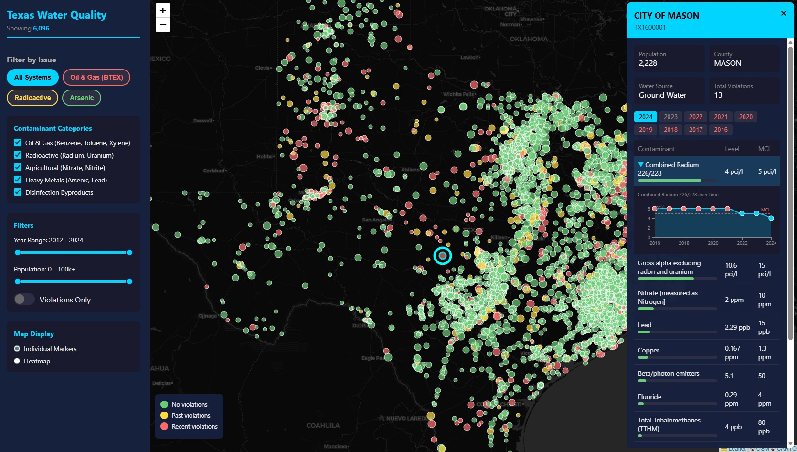

# Texas Water Quality Dashboard

This set of scripts downloads, processes, and maps public water quality data from the Texas Commission on Environmental Quality (TCEQ).



## Overview

Texas publishes water quality reports (CCRs) as individual Microsoft Word documents behind a search form. This format makes it difficult to analyze trends or identify contamination hotspots. This project scrapes the TCEQ portal, converts the `.doc` files to JSON, adds geolocation data, and displays the results on an interactive map.

## Workflow

### 1. Acquisition (`scraper.py`)
This script downloads the water system list from the state portal, then downloads all available Consumer Confidence Reports (CCRs). It outputs a directory structure of `.doc` files (e.g., `downloads/TX12345_CityName/TX12345_2023.doc`).

### 2. Processing (`process.py`)
Since the data is in binary Word files, this script converts them to HTML and parses the tables to extract to JSON files containing contaminant levels, violations, and limits.

### 3. Enrichment (`get-ids.py`)
This script scrapes the physical address, latitude and longitude, and population served for every system from the state portal. It outputs `water_system_data_full_profile.json`.

### 4. Categorization (`contaminant_categories.yaml`)
This configuration file maps specific chemical names (e.g., "Trihalomethanes", "TTHM") to broader categories (e.g., "Disinfection Byproducts"). `list_contaminants.py` can be used to audit these mappings against the scraped data.

### 5. Visualization (`build_dashboard_data.py` & `dashboard.html`)
This script merges the chemical data, location metadata, and category configuration. It splits the output into two optimized files (`dashboard_data_map.json` and `dashboard_data_details.json`) to allow the dashboard to load the map instantly while fetching details in the background.

### 6. Export (`export_csv.py`)
This script flattens the nested JSON data into a single CSV file for easier analysis in tools like Excel, Pandas, or Tableau. It generates `texas_water_quality.csv` and a compressed version `texas_water_quality.csv.zip`.

### 7. Leaderboard (`build_leaderboard.py` & `leaderboard.html`)
This script aggregates the flat CSV into a worst-to-best ranking of water systems. For each system it computes:
*   **`violation_count`**: number of rows where the contaminant level exceeded the MCL.
*   **`severity_sum`**: sum of `highest_level / mcl` across all violations. One reading at 100× the limit outweighs fifty at 1.1×.
*   **`avg_severity`**: average exceedance per violation.
*   **`impact_score`**: `population × severity_sum` — total human exposure (null when population is unknown).
*   **`composite_score`**: `0.7 × log-norm(severity) + 0.3 × log-norm(impact)` — a balanced "bad and affects people" score, log-scaled so a single extreme reading doesn't dominate the ranking. Weights are configurable in `build_leaderboard.py`.

Output is `leaderboard.json` and a standalone `leaderboard.html` with a sortable, filterable table. Serve the page with `python3 -m http.server` and open it alongside the main dashboard.

Optional flags: `--min-year YYYY` and `--max-year YYYY` limit the ranking to a specific reporting-year window (e.g., `--min-year 2020 --max-year 2024` for recent data only). Rows outside the range are counted in `rows_skipped_by_year_filter` in the output meta block.

## Dataset

For users who want to analyze the data without running the full pipeline, the processed dataset is included in this repository:

*   **`texas_water_quality.csv`**: A flat CSV containing 600,000+ rows of water quality test results.
*   **`texas_water_quality.csv.zip`**: A compressed version of the CSV for easier downloading.

**CSV Columns:**
*   `system_id`: TCEQ Water System ID (e.g., TX0010001)
*   `system_name`: Name of the water system
*   `county`: Primary county served
*   `latitude`/`longitude`: Physical coordinates of the system
*   `population`: Estimated population served
*   `year`: Reporting year of the data
*   `water_source`: Type of water (Groundwater, Surface Water, etc.)
*   `contaminant`: Name of the chemical or contaminant
*   `category`: Broad classification (e.g., Heavy Metals, Disinfection Byproducts)
*   `highest_level`: The detected level reported to TCEQ
*   `mcl`: Maximum Contaminant Level (regulatory limit)
*   `units`: Measurement units (ppm, ppb, pCi/L, etc.)
*   `violation`: Boolean indicating if the level exceeded the MCL

## Contaminant Categories

The dashboard groups hundreds of specific chemicals into user-friendly categories defined in `contaminant_categories.yaml`:

*   **Agricultural:** Fertilizers (Nitrates) and pesticides (Atrazine, Glyphosate, etc.)
*   **Heavy Metals:** Arsenic, Lead, Mercury, Chromium, etc.
*   **Oil & Gas:** Benzene, Toluene, Xylenes (BTEX), and other petrochemical indicators.
*   **Radioactive:** Radium, Uranium, and Alpha/Beta particles.
*   **Disinfection Byproducts:** Chemicals formed when chlorine reacts with organic matter (TTHM, HAA5).
*   **Industrial Solvents:** Degreasers and manufacturing chemicals (TCE, PCE, Vinyl Chloride).
*   **Plasticizers:** Chemicals used in plastics manufacturing (Phthalates).

## Technical Implementation

### Scraper
`scraper.py` parses the JSP dropdowns on `dww2.tceq.texas.gov` to build a catalog of Water System Numbers (`wsno`). It uses `subprocess` to call `curl` directly, which handles the server's connection resets better than Python's `requests` library. A `ThreadPoolExecutor` downloads reports in parallel, prioritizing recent years. State is saved to `progress.json` to allow resuming.

### Processor
The state uses the Word 97-2003 format (`.doc`), which `python-docx` cannot read. `process.py` embeds a PowerShell script that uses the COM interface to open the file in a local installation of Microsoft Word and save it as HTML. It then uses `BeautifulSoup` to identify tables containing contaminant data, normalizing units (ppb vs ppm) and detecting violations.

### Metadata
`get-ids.py` visits the specific detail page for each ID. It uses `unicodedata.normalize("NFKC", text)` to fix encoding issues common in the source HTML. It extracts coordinates from the "Source Water Inventory" tables rather than the mailing address.

### Dashboard
The dashboard runs client-side. `build_dashboard_data.py` compiles the data into two JSON artifacts using short-keys (minification) to reduce file size. The frontend uses Leaflet with Canvas markers to render the points. D3.js handles the sparkline charts in the popup panels. Filtering logic runs in the browser using the categories defined in the YAML configuration.

## Setup & Usage

**Requirements:**
*   Python 3.10+
*   Windows (for `process.py` Word conversion) or a VM with MS Word.
*   `pip install requests beautifulsoup4 tqdm pyyaml`

**Running the Pipeline:**

```bash
# 1. Download the data (Long running process)
python scraper.py

# 2. Convert .doc to .json (Requires MS Word)
python process.py --input downloads/

# 3. Fetch location metadata
python get-ids.py

# 4. Compile the dashboard data (Uses contaminant_categories.yaml)
python build_dashboard_data.py

# 5. Export to CSV
python export_csv.py

# 6. Build the leaderboard
python build_leaderboard.py

# 7. View the dashboard and leaderboard
python -m http.server 8000
# Then open http://localhost:8000/dashboard.html or /leaderboard.html
```

## License

LGPL v2.1

## Disclaimer

This is an independent project and is not affiliated with, endorsed by, or connected to the Texas Commission on Environmental Quality (TCEQ). Data is provided for informational purposes only and should be verified against official state records.
